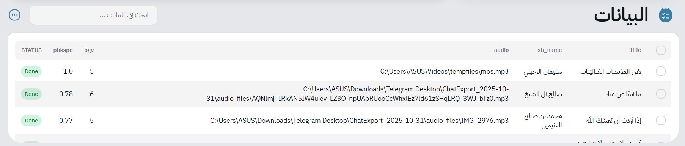
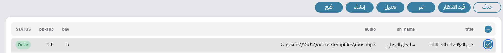

# 🧾 Data Rows

The **DataRows** section is where your actual **content lives**.
It’s a **fully integrated table** inside each project — no need to navigate away to manage your data.

---

## 📋 What Should Your Dataset Contain?

The columns (or attributes) of your dataset depend on **your template’s needs**.
Each template uses different attributes to fill its visual or textual placeholders.

For example, in the table below, you might have:



| Attribute | Description                                                                                                                                                            |
| --------- | ---------------------------------------------------------------------------------------------------------------------------------------------------------------------- |
| `title`   | The title of the video, shown prominently in the center.                                                                                                               |
| `sh_name` | The name of the Sheikh or speaker appearing in the design.                                                                                                             |
| `audio`   | *(Hardcoded attribute)* – Required for **video projects**. Specifies the audio file from which the video will be generated. *(More details in the Rendering section.)* |
| `bgv`     | A **modifier-specific** attribute (for example: background video path).                                                                                                |
| `pbkspd`  | Another modifier attribute, controlling background playback speed.                                                                                                     |

> ⚙️ **Tip:** Every project can define its own structure freely, as long as it matches the template fields and modifiers you use.

---

## 🧠 Header Functionalities

At the top of your Data Table, you’ll find two main controls:


### 🔍 Advanced Search

Mawj’s search bar is **smarter than it looks** — you can perform structured queries using attribute-based syntax.

Examples:

```text
'sh_name': 'محمد بن صالح العثيمين'
```

→ Finds all rows where `sh_name` matches the specified value.

You can also query **metadata attributes**, such as:

```yaml
'm.status': 'done' 'm.createdAt': '2025-11-01' 'm.updatedAt': '2025-11-01'
```

And even apply **sorting flags**:

```yaml
'sort': 'sh_name' 'sd': 0
```
0 = ascending, 1 = descending

Combine multiple filters for powerful search and organization!

---

## ⚙️ Options Menu

Clicking the **options icon** in the header reveals these choices:


### 📤 Upload Data

You can import new data into your project using a **CSV** or **JSON** file.
Both formats are supported — we’ll explain the structure later in this chapter.

### ➕ Add a Single Row

Use this option to **manually add** one row of data to your dataset.
It’s ideal for small updates or testing without re-uploading the entire file.

### 📦 Data Import Formats

Mawj supports two main formats for importing your dataset: **CSV** and **JSON**.

#### CSV Files

There are no strict limits, but for safety, **attribute names must use Latin characters** (English letters).
Using Arabic, Chinese, or other non-Latin characters may lead to parsing issues or unexpected behavior later during template binding.

Here’s a simple example based on the latest table format:

```csv
title,sh_name,audio,bgv,pbkspd
The Value of Time,محمد بن صالح العثيمين,audio1.mp3,forest.mp4,1.0
High Morals,صلاح بن محمد غانم,audio2.mp3,city.mp4,0.8
Mercy Among Believers,عزالدين بن سالم أبوزخار,audio3.mp3,rain.mp4,1.2
```

#### JSON Files

The JSON structure follows the same schema, formatted as an array of objects:

```json
[
  {
    "title": "The Value of Time",
    "sh_name": "محمد بن صالح العثيمين",
    "audio": "audio1.mp3",
    "bgv": "forest.mp4",
    "pbkspd": 1.0
  },
  {
    "title": "High Morals",
    "sh_name": "صلاح بن محمد غانم",
    "audio": "audio2.mp3",
    "bgv": "city.mp4",
    "pbkspd": 0.8
  }
]
```

If any uploaded file is malformed or improperly structured, Mawj automatically provides **clear validation feedback** so you can fix the format and retry quickly.

---

### 🧩 Row Selection and Fast Operations

When one or more rows are selected in your data table, a **toolbar of quick actions** appears



These actions include:

* **🗑️ Delete** — remove one or multiple selected rows.
* **⏳ Set as Pending** — mark the row(s) as awaiting generation.
* **✅ Set as Done** — mark the row(s) as completed (useful for tracking processed items).
* **✏️ Update Row Info** — edit the attributes of a single row. *(Disabled when multiple rows are selected.)*
* **🎬 Generate Output** — trigger generation for the selected row only (image or video).
* **📂 Open Output File** — open the generated output directly from your output folder if it already exists.

## Next
- [Templates](./templates.md)

## Previous
- [Projects](./projects.md)
