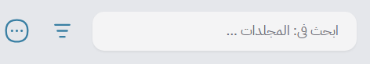
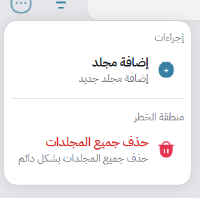
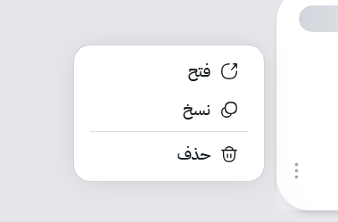

# 🗂️ Folders

When you first open Mawj, you’ll be greeted by the **Folders Page** — your main hub for managing projects.
It’s designed to help you access your work quickly and keep everything organized.

---

### 📁 Folder Management Overview

The first page you see after launching Mawj is the **Folders Page**.
Here you can view, create, or manage all your project folders —
making it easy to jump back to your ongoing work at any time.

---

### 🧭 Header Bar Functionalities

At the top of the page, you’ll find a set of quick-access tools:

* **🔍 Search Bar** – Quickly find a folder by name (especially useful once you have many).
* **↕️ Sort Icon** – Sort folders alphabetically or by creation date.
* **⚙️ Options Menu** – Opens a dropdown with additional global actions:

Inside this menu you can:

* ➕ **Add a new folder**
* 🗑️ **Delete all folders**

---

### 📂 Folder Direct Options

Each folder card has its own options.
Click the **three vertical dots (⋮)** on the folder card to open the menu:

From here you can:

* 🗑️ **Delete** the folder
* 📄 **Duplicate** it
* 🚀 **Open** the folder to view its projects

---

### ✏️ Editing Folder Info

To change a folder’s **title** or **description**:

* Simply **double-click** on the text.
* It will turn into an editable input field.
* After editing, press **Enter** — your changes will take effect **immediately**.

## Next
- [Projects](./projects.md)

## Previous
- [Configuration](./getting-started.md)
