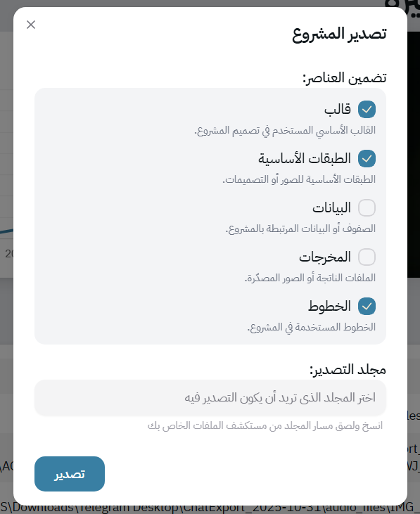
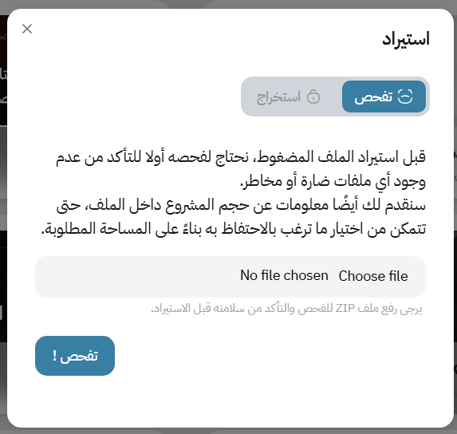

# 📂 Import & Export

Mawj makes it easy to share your projects or reuse projects from others through its import and export system.

## 📝 Export

You can export any project along with its components. The export form allows you to configure exactly what you want to include:

Datarows – your project’s dataset

Template – the design, layers, and modifiers

Fonts – any fonts used in the template

The form is self-explanatory and guides you through selecting the components you want to share.

---

## 📥 Import

To import a project shared with you, simply upload the exported file. Mawj will:

1. Scan the package for potentially malicious files or vulnerabilities.

2. Provide a full warning report highlighting anything suspicious.

3. Allow you to extract safely once you are satisfied.

After extraction, you can configure what to keep from the imported project. For example, you might want to skip the datarows if they are irrelevant to your work.

When importong projects, Mawj saves fonts in a folder you specify. If you don’t choose a folder, fonts are imported to a default folder on your desktop. This ensures you can install them later, while avoiding the risks of automatic font installation.

---

## ⚠️ Security & Privacy Considerations

Some layers or modifiers (e.g., image layers) may perform network requests during rendering. The same thing goes for audio files with remote addresses.

This could expose your public IP address. While generally safe, if privacy is important, review layers, modifiers, and data (like audio files) before rendering.

Mawj gives you full control so you can import and export safely while maintaining your workflow flexibility.

## Next
- [License](./license.md)

## Previous
- [Rendering](./rendering.md)
