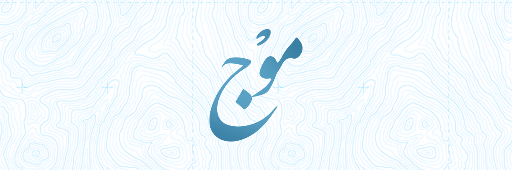

# Mawj

> Bulk card & video generator for content creators who care about **quality**, **speed**, and **automation**.

---

## 🌊 What is Mawj?

**Mawj** (موج) is a desktop tool that helps you **generate visual content** — cards, videos, and booklets — in bulk, using flexible templates powered by a custom **HTML/CSS rendering**.

It allows you to define templates once and feed them with datasets (CSV/JSON), producing hundreds of assets automatically — while preserving artistic precision, Arabic typography, and creative consistency.

---

## 💡 The Philosophy Behind Mawj

When I started creating dawah content regularly, I noticed how much time was wasted repeating the same visual steps:
writing quotes, designing backgrounds, resizing text, adjusting margins, exporting manually.

**Mawj was born from a simple idea:**
> *“Focus on the message — let the system handle the repetition.”*

That’s why Mawj was designed around three principles:

1. **Automation without compromise.**
   Every rendered card or video should look handcrafted, not robotic.

2. **Scalability through simplicity.**
   The workflow should scale from 10 to 1000 outputs with no added complexity.

3. **Beauty and accuracy.**
   Arabic typography, alignment, and aesthetics are treated as first-class citizens.

Mawj is not a mass-production tool.
It’s a **creative multiplier** for those who want to spread goodness beautifully and efficiently.

---

## 🧩 Core Structure: Template, Data, and Project

At the heart of Mawj’s workflow are three essential components that work together seamlessly:

### 🧱 Template

Defines how your content looks — layers, fonts, colors, layout, and animation.
Templates can be designed visually or crafted through flexible **HTML/CSS-based layouts**.

### 📄 Data

Holds your content — titles, quotes, ayat, hadeeth, or text snippets.
Each data entry is applied to the template to produce a distinct visual or video.

### 📁 Project

Brings everything together — it connects templates and data, tracks analytics, manages settings, and handles content generation and exports.
Projects are self-contained and reusable, making it easy to organize campaigns or thematic series.

---

## ⚙️ Core Features

- 🧩 **Flexible Templates** – Powered by HTML/CSS with multi-layer and modifier support.
- 🪄 **Interpolation Engine** – Smooth transitions between values (e.g., font size, opacity, position).
- 🎥 **Video & Image Rendering** – Uses Puppeteer, node-canvas, and FFmpeg for perfect exports.
- 🎚️ **Modifiers System** – Control mirroring, fades, overlays, and dynamic backgrounds.
- 🔡 **Font Management** – Arabic and Latin font support with local loading.
- 📈 **Analytics Dashboard** – Visual stats for generation activity and render metrics.
- 🧮 **Bulk Data Support** – Generate thousands of renders in one run.
- 💾 **Import/Export Templates** – Share templates with assets and fonts included.
- 🔧 **Configuration Control** – Choose resolution, bitrate, GPU encoding, and output paths.

---

## 🌱 Why I Built Mawj

Because dawah deserves **professional tools** —
not recycled social media editors or templates.

I wanted to create something that **balances artistic control and automation**,
allowing anyone to generate consistent, high-quality Dawah materials without needing to be a designer or video editor.

Mawj is not a commercial product —
it’s a **tool made out of love for knowledge sharing** and for the people doing it with sincerity.

---

## Next

- [Getting Started →](./getting-started.md)

---

> *Mawj v0.5.3 – Built for those who believe that every pixel can carry a message.*

## Index

1. [Getting Started](getting-started.md)
2. [Configuration](configuration.md)
3. [Folders](folders.md)
4. [Projects](projects.md)
5. [Datarows](datarows.md)
6. [Templates](templates.md)
7. [Layers](layers.md)
8. [Modifiers](modifiers.md)
9. [Interpolation](interpolation.md)
10. [Rendering](rendering.md)
11. [Import Export](import-export.md)
12. [License](license.md)
