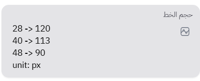
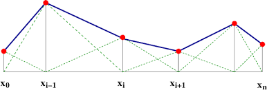

# 📈 Interpolation

Some numerical attributes in Mawj can be made **flexible** depending on your text content’s length — for example, automatically **reducing font size** when the text gets longer.
This gives your designs a natural balance, avoiding overflowing or cramped text.

---

## ⚙️ How It Works

You’ll notice some numerical inputs (like **font size**, **line height**, etc.) have a small **cellular box icon** next to them.

When you click that icon, it reveals a **textarea** where you can define an interpolation recipe — a small, human-readable “mini language” that tells Mawj how to scale values smoothly.

Mawj then uses **piecewise-linear interpolation** to estimate values that fall between your defined breakpoints.

Interpolation Mode (Font Size):



Simple Numeric Mode (Opacity):


---

### ✍️ Example

Here’s a simple recipe for an interpolated **font size**:

```
28 -> 120
40 -> 113
48 -> 90
unit: px
consider_diacritics: false
```

**Explanation:**

* The left column is the **text length**.
* The right column is the **target value** (e.g., font size).
* `unit` defines the measurement unit (e.g., `px`, `pt`, `%`… you can leave it out for unitless properties like `opacity`).
* `consider_diacritics` controls how Arabic diacritics are handled during text length calculation.

---

### 🕌 Diacritics Handling (for Arabic Text)

For Arabic content, diacritics (التشكيل) often don’t significantly affect the visual width of text.
That’s why Mawj gives you the option to **ignore them in length calculations**.

If `consider_diacritics` is:

* `false` (or not set): diacritics are ignored in the length count.
* `true`: diacritics are counted.

You can see both versions of the text length (with and without diacritics) directly in the interpolation view:


---

### 📊 Visualization

Mawj treats your recipe as **breakpoints** and automatically fills the gaps by interpolation.
This image shows how it works conceptually:



The curve is built between your defined points — giving you smooth scaling that feels natural for your text layout.

---

### 💡 Tips

* You can use interpolation for **any numeric field** that supports it, not just font size.
* The feature is great for keeping your templates visually consistent even with varying text lengths.
* Try experimenting with different breakpoints — Mawj handles interpolation gracefully, even with sparse data.


## Next
- [Rendering](./rendering.md)

## Previous
- [Modifiers](./modifiers.md)
