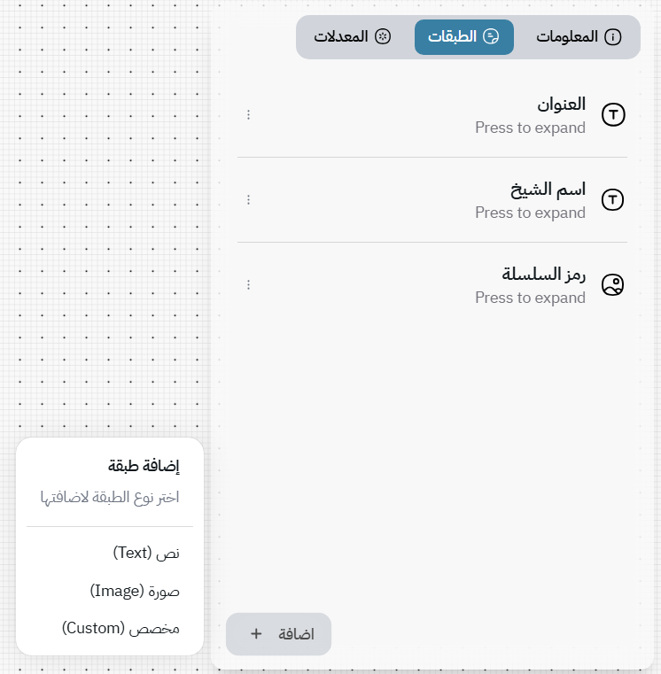
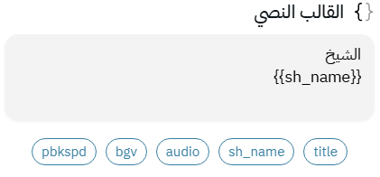

# 🧩 Layers

Layers are the **building blocks** of your template — each one represents a visual or textual element that appears in your final image or video.
Think of them as **stacked transparent sheets**, each contributing a piece to the full design.



---

### 📜 Base Layers

Base layers act as your **canvas foundation** — like a blank book cover waiting for titles and artwork.
They’re the background upon which your text, images, and effects will sit.

Base layer, are **static**, meaning they don't change throughout different rows. If you want them to change for different rows, then you should definitly use the **Background Control Modifier** (see [Modifiers](./modifiers.md) chapter)

---

### 💬 The Textarea

Each layer has a **textarea input**, where you write your **template text** — this connects your **data** to your **design**.
For example, if your dataset has a `sh_name` column, you can write something like:

```
الشيخ
{{sh_name}}
```

to display the shiekh name value for each data row.



**📝 NOTE: About fonts**
Mawj uses a scanner to scan all your **installed** fonts on your PC.

---

### 🧱 Layer Types

You can add new layers using the **Add** button at the **bottom-left** of the sidebar.
Mawj currently supports three main types of layers:

---

#### 🅰️ Text Layer

The most fundamental and versatile type.

You can define your text content and customize its properties — such as **font**, **color**, **position**, **alignment**, **size**, and more — using the provided controls.

Some options have a small **cell-like icon** next to them — this indicates that the property can be **interpolated**, meaning it can change smoothly between values during animation or across frames.
(See the **Interpolation** chapter for details.)

---

#### 🖼️ Image Layer

Simpler than text layers — used for displaying static or dynamic images.

The layer’s **template text** should point to an image path or URL.
For example:

```
https://example.com/{{img_name}}.png
```

In your dataset, you can have an `img_name` column whose value is either an absolute path on your device or an online image URL.

---

#### ⚙️ Custom Layer

The most **powerful** and flexible type — but also the one that requires a bit of experience.

Custom layers let you write **HTML + CSS** directly.
This means you can create **any structure or design** imaginable — from gradient shapes to mixed layouts or advanced typography.
In fact, **text** and **image layers** are just *special cases* of this custom layer system.

For example:

```html
<div class="quote">
  
  <p>{{text}}</p>
</div>

<style>
.quote {
  width: 100%;
  text-align: center;
  color: white;
  font-family: "Amiri";
}
.backdrop {
  opacity: 0.2;
  filter: blur(4px);
}
</style>
```

---

### 💡 Tips

* **Rename quickly:** Double-click on a layer’s title or description to rename it.
* **Manage easily:** Use the **three-dot menu** in each layer header to **delete**, **duplicate**, or **hide** the layer.
* **Order matters:** The **layer order** determines which element appears above or below others — just like layers in Photoshop or Figma.
* **Use custom layers wisely:** They’re powerful, but overusing them can make your template harder to maintain.

## Next
- [Modifiers](./modifiers.md)

## Previous
- [Templates](./templates.md)
