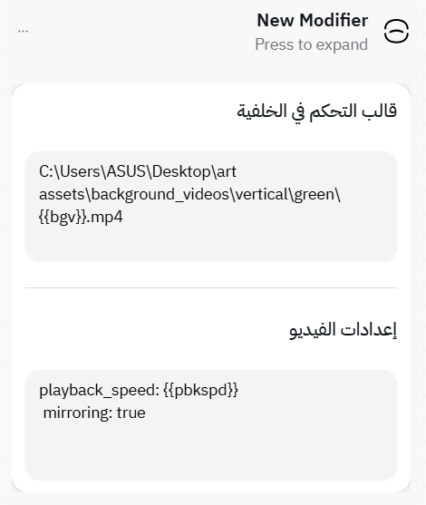

# 🎛️ Modifiers

If you want **extra control** and **dynamic behavior** in your templates, this is where you go.

Modifiers extend Mawj’s capabilities beyond static layers — they let you add logic, animation, and behavior to your projects.
They can affect how the **base layer** behaves, how **audio and video** are rendered, and more.

> ⚠️ Modifiers are a relatively new feature — but they’re already powerful additions, and more are under active development.

---

## 🪄 Current Modifiers

### 🖼️ Background Control Modifier

*(also known as the Base Layer Control Modifier)*



This modifier allows you to **change the base layer dynamically** based on the data row being rendered.
It’s extremely useful when:

* You want **different backgrounds** for each video or image.
* You’re using **video backgrounds** with playback settings.
* You’re rendering a **series** with the same layout but different backgrounds.

#### ✨ Features:

* Set **custom base layer per row** (e.g., different image or video each time).
* Define **playback speed** and **mirroring** behavior for video backgrounds.
* Works perfectly with both **static image** and **video-based** templates.

You can configure playback options using a small snippet like this:

```
playback_speed: {{pbkspd}}
mirroring: true
crossfade: 1s
```

Here, `pbkspd` is a column in your dataset.
When rendering each row, Mawj replaces `{{pbkspd}}` with the corresponding value.

#### The oprions available:
- `playback_speed`: the playback speed of the video.
- `mirroring`: (true/false) should the renderer mirror the background video after it ends to the next iteration (i've used it to introduce some smoothing).
- `crossfade`: ('duration's) crossfade effect for smooth transitions between iterations (if it present, the mirroring is canceled).

---

### 🌫️ Fade In/Out Modifier *(under development)*

This modifier adds **fade-in and fade-out effects** to your video clips — useful for smooth transitions or cinematic intros/outros.

Once implemented, it will support custom durations and easing settings.

---

### 🔊 Audio Overlay Modifier *(under development)*

This modifier will allow you to **overlay sound effects or nasheeds** over your main audio — perfect for creating more engaging and polished videos.

---

### 🎬 Intro/Outro Modifier *(under development)*

Designed to let you **attach intro or outro clips** to your rendered videos.
You’ll be able to define intro/outro templates once and reuse them across multiple projects.

---

### 💡 Tips

* Modifiers are **project-level tools**, not template-level — meaning they apply when rendering, not when designing the template.
* You can combine multiple modifiers together for complex behaviors.
* Always keep your dataset attributes consistent with what your modifier expects (e.g., `pbkspd`, `bgv`, etc.).

## Next
- [Interpolation](./interpolation.md)

## Previous
- [Layer](./layers.md)
