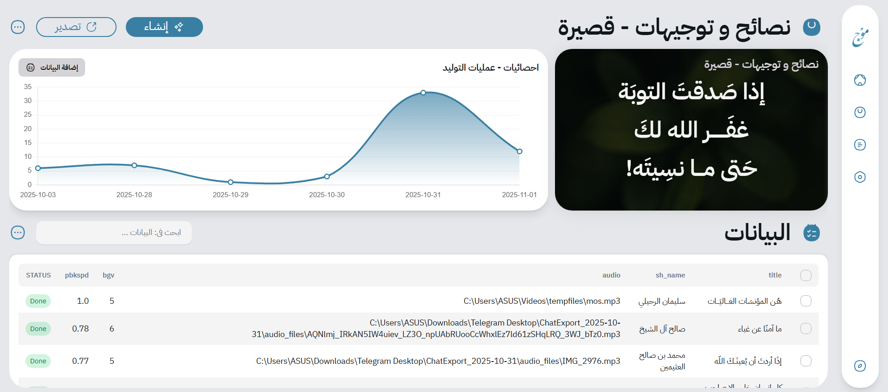
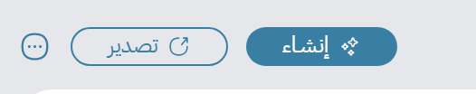
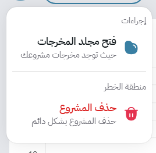

# 📁 Projects

The **Projects Page** lists all your existing projects — each representing a complete setup containing a template, data, and outputs.

Just like folders, you can easily search, sort, and manage projects here.

---

### 🧭 Project Cards

Each project appears as a **card** showing its title and basic details.
The **options and direct actions** work just like folders — no need to repeat them all here.

> 📝 **Note:** In a project card’s direct options, there’s an extra **📂 “Folders” option**.
> You can use it to add a project to a specific folder for better organization.

---

### 🚀 Opening a Project

Click on any project card to open its main page.

Inside, you’ll find all the essential information and tools, including:

* 📊 **Analytics overview**
* 🧾 **Data rows and content entries**
* 🎨 **Linked template details** or the ability to select another one
* ⚙️ **Quick access to settings and actions**

Once you’ve done some work, your project page will look like this:

---

### ⚙️ Header Bar Options

Just like the Folders Page, the Projects Page includes a handy header section:

This header contains:

* ▶️ **Generate button** – Starts the rendering process (discussed in the *Rendering* section).
* 📦 **Export button** – Exports the project (covered in the *Import & Export* section).
* ⚙️ **Options icon** – Opens additional project utilities.

---

### 🧰 Project Options

Clicking the **options icon** reveals useful tools:

* 📂 **Open in File Explorer** – Opens your project’s **output folder**, where all generated images and videos are stored. A very convenient shortcut!
* 🗑️ **Delete Project** – Removes the project from Mawj.

## Next
- [Datarows](./datarows.md)

## Previous
- [Folders](./folders.md)
