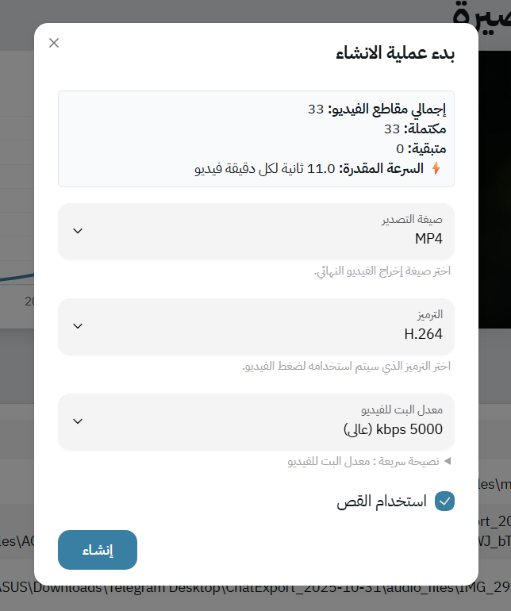

# 🎞️ Rendering

Once your **project** and **template** are ready, you can start rendering your outputs — whether images or videos.

Mawj’s rendering system is built for speed, flexibility, and clarity. You don’t need to manually tweak config files — the **generation form** provides all the options you need, along with helpful tooltips that guide you toward the best settings depending on your use case.

📸 **Example rendering form:**
*(This screenshot illustrate the available configurations and tooltips — most users won’t need to touch advanced options.)*



## 🎧 Video Rendering and Audio Handling

When working on **video projects**, an `audio` attribute **must be present** in your dataset.
This column defines the source audio for each rendered video.

The value of the `audio` field can be either:

* An **absolute path** on your machine, or
* An **HTTP/HTTPS link**, which Mawj will automatically download and delete after rendering.

### ✂️ Trimming Audios

One of Mawj’s most useful features for video creation is **audio trimming** — perfect for creating short clips from long lectures.

To enable trimming, simply include two additional columns in your dataset:

| Column | Description                |
| ------ | -------------------------- |
| `from` | The start time of the clip |
| `to`   | The end time of the clip   |

Both values should follow the format:

```
01:38:18.480
```

This allows you to generate **multiple short videos from a single audio file**, completely automatically — no manual editing or trimming required.

## Next
- [Import & Export](./import-export.md)

## Previous
- [Interpolation](./interpolation.md)
