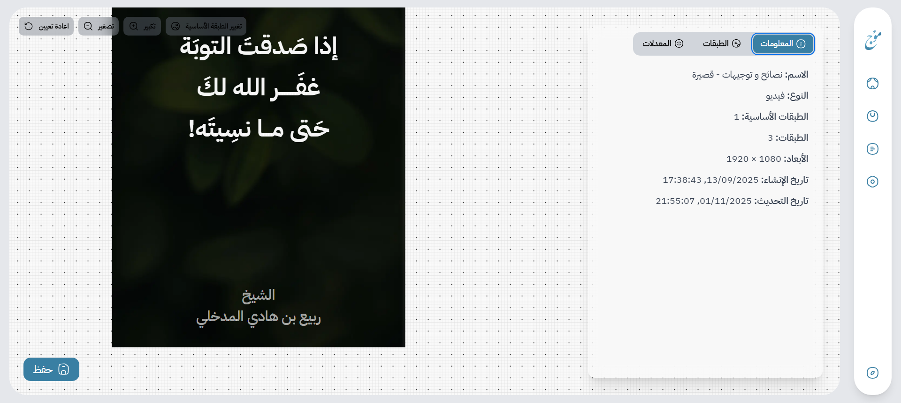

# 🎨 Templates

The `/templates` page is almost **identical** to the Projects page — it lists all your templates, with similar card options and quick actions.

When you **click on a template card**, you’ll enter the **canvas workspace** — this is your **template workshop**, where the actual design and layout magic happens.

Here’s how the workspace typically looks:

---

### 🧭 Sidebar Overview

On the left side of the canvas, you’ll find the **sidebar**, which contains three main tabs:

1. **Metadata** — for general template information such as name, description, and resolution.
2. **Layers** — the core visual building blocks of your design (images, text, etc.).
3. **Modifiers** — tools for extra control on your templates.

---

### 🧱 Base Layer Setup

Before you begin designing, Mawj will prompt you to **upload a base layer** — usually a background image or initial layout.
This acts as the **foundation** of your template, upon which you’ll add and organize all other layers.

If you’re wondering what exactly “layers” are and how they work — don’t worry.
The **next chapter** is fully dedicated to **Layers**, explaining the different types, how to configure them, and how they interact with modifiers.

---

### 💾 Saving and Shortcuts

After making your edits, simply click the **Save** button located in the **bottom-left corner** of the canvas.

You can also use **keyboard shortcuts** for efficiency:

* `Ctrl + Z` → Undo
* `Ctrl + Y` → Redo

These shortcuts work seamlessly within the canvas environment, giving you a smoother editing workflow.

## Next
- [Layers](./layers.md)

## Previous
- [Datarows](./folders.md)
